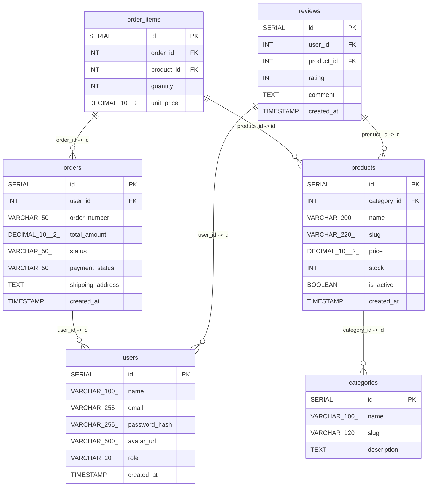

# ⚡ schemagraph

<p align="center">
  
</p>

<p align="center">
  <strong>Zero-Dependency Database Architecture & Relational ERD Generator for Node.js</strong><br>
  <em>Instantly scan backend schemas & frontend models, map relational dependencies, and generate responsive vector SVGs, interactive single-page HTML explorers, Mermaid diagrams, DBML, and SQL DDL.</em>
</p>

<p align="center">
  <a href="https://www.npmjs.com/package/schemagraph"></a>
  <a href="https://nodejs.org"></a>
  <a href="LICENSE"></a>
  <a href="LICENSE"></a>
</p>

---

## 🌟 Highlights

- 🚫 **Zero External Dependencies**: Pure Node.js standard library (`fs`, `path`, `crypto`, `events`, `os`). Under **40 KB** install footprint. Zero supply-chain security risks.
- 🎯 **Universal Multi-Dialect Support**: Automatically detects and parses:
  - **SQL DDL** (`.sql` files with `CREATE TABLE`, `PRIMARY KEY`, `FOREIGN KEY ... REFERENCES`)
  - **Prisma Schema** (`.prisma` models, `@id`, `@unique`, `@relation(fields, references)`)
  - **Mongoose / MongoDB** (`new Schema({ ... })`, `ref: 'Model'`)
  - **Sequelize ORM** (`sequelize.define`, `Model.init`, `hasMany`, `belongsTo`)
  - **TypeORM** (`@Entity`, `@PrimaryGeneratedColumn`, `@ManyToOne`, `@JoinColumn`)
  - **GraphQL SDL** (`.graphql`, `.gql` type definitions and object relations)
  - **Frontend / TS Types** (`interface User`, `type Order`, `z.object` Zod schemas)
- 🎨 **7 Export Formats in a Single Command**:
  1. **Responsive XML SVG**: Modern dark & light developer themes (*Catppuccin Mocha*, *Tokyo Dark*, *Slate Light*), table cards, `[PK]` and `[FK]` badges, cubic bezier curves.
  2. **Interactive Single-Page HTML Explorer**: Standalone web app with smooth mouse pan/zoom, live table/column search filter, schema metrics, and instant SVG/PNG/JSON downloads.
  3. **Mermaid Markdown (`.md`)**: GitHub/GitLab native `erDiagram` block + formatted data dictionary tables.
  4. **JSON Schema Map (`.json`)**: Machine-readable AST for CI/CD pipelines, documentation generators, or scripts.
  5. **DBML (`.dbml`)**: Standard Database Markup Language compatible with [dbdiagram.io](https://dbdiagram.io) and [dbdocs.io](https://dbdocs.io).
  6. **Graphviz DOT (`.dot`)**: Compatible with Graphviz graph engines (`dot`, `neato`, `d3-graphviz`).
  7. **Normalized SQL DDL (`.sql`)**: Clean, standard SQL `CREATE TABLE` and constraint statements.

---

## 📊 Live GitHub Mermaid ERD Demo

This diagram is rendered natively on GitHub using the Mermaid export produced by `schemagraph`:



---

## 🚀 Quick Start

### 1. Instant Run (Zero Install via `npx`)

```bash
# Scan current project and export default SVG & Interactive HTML
npx schemagraph

# Scan backend directory and generate ALL 7 formats to ./docs
npx schemagraph ./backend --format=all --output=./docs
```

### 2. Global Installation

```bash
npm install -g schemagraph
```

Then run anywhere:
```bash
schemagraph
# or
pure-erd
```

---

## 💻 CLI Options & Usage

```bash
schemagraph [targetDir] [options]
```

### Options Reference

| Option | Flag | Default | Description |
| :--- | :--- | :--- | :--- |
| `--format` | `-f` | `svg,html` | Formats: `svg`, `html`, `md`, `json`, `dbml`, `dot`, `sql`, or `all` |
| `--output` | `-o` | `.` | Target output directory for generated assets |
| `--theme` | `-t` | `catppuccin` | Visual theme: `catppuccin`, `dark`, or `light` |
| `--title` | | `Database Schema Topology` | Custom diagram header title |
| `--exclude`| `-e` | `node_modules,.git,...` | Comma-separated directories to ignore |
| `--help` | `-h` | | Display help manual |
| `--version`| `-v` | | Display version number |

### Real-World CLI Examples

```bash
# 1. E-Commerce Backend (PostgreSQL / MySQL)
schemagraph ./backend/src/models --format=all --theme=catppuccin --output=./docs

# 2. Prisma Project
schemagraph ./prisma --format=svg,html,md -t dark --title="SaaS Platform ERD"

# 3. Light Theme for Wiki Documentation
schemagraph ./src/database -f svg,html -t light --output=./wiki/assets

# 4. Generate dbdiagram.io DBML and GitHub Mermaid ERD
schemagraph ./backend -f dbml,md --output=./docs
```

---

## 🌐 Interactive HTML Single-Page Viewer Features

When you export with `--format=html` (or `all`), `schemagraph` produces a standalone, self-contained HTML app ([preview here](./assets/database-design.html)):

- 🔍 **Live Model & Column Filter**: Instantly search by table name or property name.
- 🖱️ **Pan & Zoom Canvas**: Smooth mouse dragging, scroll zooming, and one-click reset.
- 📈 **Schema Statistics HUD**: Real-time metrics for total tables, columns, and foreign key relations.
- 💾 **Instant One-Click Exports**: Download raw SVG vector, PNG raster, or JSON AST directly from your browser.
- 📦 **Zero External Scripts**: Fully embedded CSS and Vanilla JS — works completely offline without CDN connections.

---

## 📦 Programmatic Node.js API

Use `schemagraph` directly in your Node.js scripts, migration hooks, or build pipelines:

```javascript
const {
    parseProject,
    generateSVG,
    generateHTML,
    generateMarkdown,
    generateJSON,
    generateDBML,
    generateDOT,
    generateSQL
} = require('schemagraph');

// 1. Scan and parse workspace schema models
const schemaMap = parseProject('./backend');

// 2. Generate SVG string
const svg = generateSVG(schemaMap, {
    theme: 'catppuccin', // 'catppuccin' | 'dark' | 'light'
    title: 'Application Architecture'
});

// 3. Generate Interactive HTML Viewer
const html = generateHTML(schemaMap, {
    title: 'Database Explorer'
});

// 4. Generate Mermaid Markdown
const markdown = generateMarkdown(schemaMap);

// 5. Generate JSON AST
const jsonAst = generateJSON(schemaMap);

// 6. Generate DBML (dbdiagram.io)
const dbml = generateDBML(schemaMap);

// 7. Generate SQL DDL
const sql = generateSQL(schemaMap);
```

---

## 🎨 Themes & Visual Styling

| Theme | Identifier | Description |
| :--- | :--- | :--- |
| **Catppuccin Mocha** | `catppuccin` *(default)* | Soothing dark pastel palette with glowing accent connector lines. |
| **Tokyo Dark** | `dark` | Deep slate blue background with electric blue headers and pink relationship lines. |
| **Slate Light** | `light` | High-contrast clean indigo palette designed for print, PDFs, and light wikis. |

---

## 🧪 Testing

Run the automated test suite powered by Node.js native `node:test`:

```bash
npm test
```

```text
✔ 24/24 tests passing (SQL, Prisma, Mongoose, Sequelize, TypeORM, GraphQL, TS Types, Zod, All 7 Renderers)
```

---

## 🚢 Publishing to npm

To publish this package to npm under your account:

1. **Log in to your npm account**:
   ```bash
   npm login
   ```
2. **Publish the package**:
   ```bash
   npm publish --access public
   ```

---

## 📄 License

MIT License © 2026 [Shailesh Thakor](https://github.com/SKThakor137)
