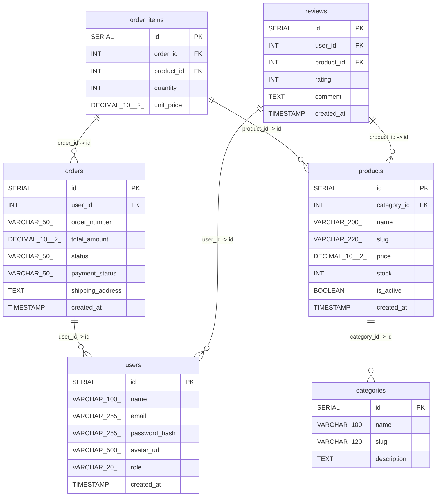

# ⚡ schemagraph

<p align="center">
  
</p>

<p align="center">
  <strong>Universal Zero-Dependency Database Architecture & Relational ERD Generator</strong><br>
  <em>Instantly scan backend schemas & frontend models across any framework, map relational dependencies, and generate responsive vector SVGs, interactive single-page HTML explorers, Mermaid diagrams, DBML, and SQL DDL.</em>
</p>

<p align="center">
  <a href="https://www.npmjs.com/package/schemagraph"></a>
  <a href="https://nodejs.org"></a>
  <a href="LICENSE"></a>
  <a href="LICENSE"></a>
</p>

---

## ⚡ Instant Run (Single Command - No Install Needed)

Run `schemagraph` in your project folder right now with `npx`:

```bash
# 🚀 1. Scan current project and generate SVG & Interactive HTML
npx schemagraph

# 📦 2. Scan backend directory and generate ALL 7 formats into ./docs
npx schemagraph ./backend --format=all --output=./docs
```

### 🎯 One-Line Commands by Framework

```bash
# 🐘 1. Laravel (PHP)
npx schemagraph ./database/migrations --format=all --output=./docs

# 🐍 2. Django & Python
npx schemagraph ./models.py --format=all --output=./docs

# 💎 3. Ruby on Rails
npx schemagraph ./db --format=all --output=./docs

# 🐹 4. Go / GORM
npx schemagraph ./internal/models --format=all --output=./docs

# ☕ 5. Java & Kotlin (Spring Boot JPA)
npx schemagraph ./src/main/java --format=all --output=./docs

# ⚡ 6. Prisma / Node.js
npx schemagraph ./prisma --format=all --output=./docs

# 🗄️ 7. Relational SQL Migrations (PostgreSQL, MySQL, SQLite)
npx schemagraph ./migrations --format=all --output=./docs
```

> 💡 **Optional Global Install**:
> ```bash
> npm install -g schemagraph
> schemagraph  # run anywhere
> ```

---

## 🌟 Why schemagraph?

- 🚫 **Zero External Dependencies**: Built strictly using pure Node.js standard library (`fs`, `path`, `crypto`, `events`, `os`). Under **40 KB** install footprint. Zero supply-chain security risks.
- ⚡ **Instant Performance**: Scans and parses 50+ models and generates all diagrams in under **50 milliseconds**.
- 🎯 **Universal Multi-Framework Auto-Discovery**: Automatically detects and parses:
  - 🐘 **PHP / Laravel**: Migration files (`database/migrations/*.php` with `Schema::create`, `Blueprint`, `foreignId()`, `constrained()`) and Eloquent models (`belongsTo`, `hasMany`).
  - 🐍 **Python / Django & SQLAlchemy**: Django models (`models.Model`, `ForeignKey`) and SQLAlchemy (`Base`, `Column`, `ForeignKey`).
  - 💎 **Ruby on Rails**: Schema (`db/schema.rb`, `db/migrate/*.rb`), `create_table`, `add_foreign_key`, and ActiveRecord models (`belongs_to`, `has_many`).
  - 🐹 **Go / GORM**: Structs with `gorm:"primaryKey"`, `gorm:"foreignKey"`, and relationship fields.
  - ☕ **Java & Kotlin (Spring Boot)**: JPA / Hibernate `@Entity`, `@Table`, `@Id`, `@Column`, `@ManyToOne`, `@JoinColumn`.
  - ⚡ **Node.js & TypeScript**: Prisma (`.prisma`), Mongoose, Sequelize, TypeORM, GraphQL SDL (`.graphql`), TypeScript interfaces (`interface User`), Zod (`z.object`).
  - 🗄️ **Relational SQL DDL**: `.sql` files with `CREATE TABLE`, `PRIMARY KEY`, `FOREIGN KEY ... REFERENCES` for PostgreSQL, MySQL, SQLite, MariaDB.
- 🎨 **7 Export Formats in a Single Command**:
  1. **Responsive XML SVG**: Modern dark & light developer themes (*Catppuccin Mocha*, *Tokyo Dark*, *Slate Light*), table cards, `[PK]` and `[FK]` badges, cubic bezier curves.
  2. **Interactive Single-Page HTML Explorer**: Standalone web app with draggable cards, live table/column search filter, connection inspector, minimap, and instant SVG/PNG/JSON downloads.
  3. **Mermaid Markdown (`.md`)**: GitHub/GitLab native `erDiagram` block + formatted data dictionary tables ready for `README.md`.
  4. **JSON Schema Map (`.json`)**: Machine-readable AST for CI/CD pipelines, documentation generators, or scripts.
  5. **DBML (`.dbml`)**: Standard Database Markup Language compatible with [dbdiagram.io](https://dbdiagram.io) and [dbdocs.io](https://dbdocs.io).
  6. **Graphviz DOT (`.dot`)**: Compatible with Graphviz graph engines (`dot`, `neato`, `d3-graphviz`).
  7. **Normalized SQL DDL (`.sql`)**: Clean, standard SQL `CREATE TABLE` and constraint statements.

---

## 📊 Live GitHub Mermaid ERD Demo

This diagram is rendered natively on GitHub using the Mermaid export produced by `schemagraph`:



---

## 💻 CLI Options Reference

```bash
schemagraph [targetDir] [options]
```

| Option | Flag | Default | Description |
| :--- | :--- | :--- | :--- |
| `--format` | `-f` | `svg,html` | Formats: `svg`, `html`, `md`, `json`, `dbml`, `dot`, `sql`, or `all` |
| `--output` | `-o` | `.` | Target output directory for generated assets |
| `--theme` | `-t` | `catppuccin` | Visual theme: `catppuccin`, `dark`, or `light` |
| `--title` | | `Database Schema Topology` | Custom diagram header title |
| `--exclude`| `-e` | `node_modules,.git,...` | Comma-separated directories to ignore |
| `--help` | `-h` | | Display help manual |
| `--version`| `-v` | | Display version number |

---

## 🌐 Interactive HTML Viewer Features

When you export with `--format=html` (or `all`), `schemagraph` produces a standalone, self-contained single-page web app.

👉 [**🚀 Click Here to Open the Live Interactive HTML Explorer in your Browser**](https://htmlpreview.github.io/?https://github.com/SKThakor137/Database-Design-Package/blob/main/assets/database-design.html)

> 💡 **Offline & Local Use**: When generated in your project, simply double-click `database-design.html` or open it with your browser (`open database-design.html` or `start database-design.html`). It has **zero CDN dependencies** and works 100% offline.

### What's Inside the Interactive Viewer:
- 🖱️ **Real-Time Draggable Table Cards**: Reposition any table node freely; connection lines dynamically recalculate and follow in 60fps.
- 🔍 **Left-Sidebar Connection Inspector**: Click any table to see all **outgoing foreign keys** and **incoming referenced-by tables** with one-click navigation jump buttons.
- 🗂️ **Compact Mode for Large Schemas**: Toggle between full columns view and compact keys-only view (70% smaller cards for 50+ table schemas).
- 📐 **Fit to Screen**: One-click auto-centering and scaling to fit the entire database on your screen.
- 🗺️ **Interactive Minimap**: Radar bird-eye navigator for instant panning across massive enterprise databases.
- 💾 **Instant 1-Click Exports**: Download raw SVG vector, PNG raster image, or JSON AST directly from your browser.
- 🎨 **Dark & Light Themes**: Pre-styled with modern developer palettes (*Catppuccin Mocha* and *Tokyo Dark*).

---

## 📦 Programmatic Node.js API

Use `schemagraph` directly in your Node.js scripts, migration hooks, or build pipelines:

```javascript
const {
    parseProject,
    generateSVG,
    generateHTML,
    generateMarkdown,
    generateJSON,
    generateDBML,
    generateDOT,
    generateSQL
} = require('schemagraph');

// 1. Scan and parse workspace schema models
const schemaMap = parseProject('./backend');

// 2. Generate SVG string
const svg = generateSVG(schemaMap, {
    theme: 'catppuccin', // 'catppuccin' | 'dark' | 'light'
    title: 'Application Architecture'
});

// 3. Generate Interactive HTML Viewer
const html = generateHTML(schemaMap, {
    title: 'Database Explorer'
});

// 4. Generate Mermaid Markdown
const markdown = generateMarkdown(schemaMap);

// 5. Generate JSON AST
const jsonAst = generateJSON(schemaMap);

// 6. Generate DBML (dbdiagram.io)
const dbml = generateDBML(schemaMap);

// 7. Generate SQL DDL
const sql = generateSQL(schemaMap);
```

---

## 🎨 Built-in Themes

| Theme | Identifier | Description |
| :--- | :--- | :--- |
| **Catppuccin Mocha** | `catppuccin` *(default)* | Soothing dark pastel palette with glowing accent connector lines. |
| **Tokyo Dark** | `dark` | Deep slate blue background with electric blue headers and pink relationship lines. |
| **Slate Light** | `light` | High-contrast clean indigo palette designed for print, PDFs, and light wikis. |

---

## 🤖 Continuous Integration & Automation Recipes

### Auto-generate ERD on Git Commit (Husky)
Add to your `package.json` scripts to keep docs in sync with your migrations automatically:
```json
{
  "scripts": {
    "docs:db": "schemagraph ./backend --format=all --output=./docs"
  }
}
```

### GitHub Actions Workflow
Automatically regenerate and commit updated diagrams when schema files change:
```yaml
name: Generate Database ERD
on:
  push:
    paths:
      - 'database/migrations/**'
      - 'prisma/**'
      - 'models/**'
      - 'migrations/**'

jobs:
  build-docs:
    runs-on: ubuntu-latest
    steps:
      - uses: actions/checkout@v4
      - uses: actions/setup-node@v4
        with:
          node-version: '20'
      - run: npx schemagraph ./ --format=all --output=./docs
      - name: Commit updated ERD
        run: |
          git config --global user.name "github-actions[bot]"
          git config --global user.email "github-actions[bot]@users.noreply.github.com"
          git add docs/
          git commit -m "docs(db): update database architecture diagrams [skip ci]" || exit 0
          git push
```

---

## 🥊 Comparison with Other Tools

| Feature | `schemagraph` | prisma-erd-generator | dbdocs / dbml-cli | Graphviz (dot) |
| :--- | :---: | :---: | :---: | :---: |
| **External Dependencies** | **0 (Zero)** | 15+ npm packages | 20+ npm packages | Requires C++ Binary |
| **Universal Multi-Framework Support** | **Laravel, Django, Rails, Go, Spring, Prisma, Mongoose, Sequelize, TypeORM, GraphQL, SQL** | Prisma Only | DBML Only | DOT only |
| **Output Formats** | **7 Formats** (SVG, HTML, MD, JSON, DBML, DOT, SQL) | SVG / PNG | Web / DBML | SVG / PNG |
| **Interactive HTML App** | **Yes** (Pan/Zoom, Drag, Search, Minimap) | No | Web Hosted | No |
| **Execution Speed** | **< 50ms** | ~2000ms | ~1500ms | ~800ms |
| **Offline / Air-gapped** | **100% Offline** | Partial | Needs Internet | Offline |

---

## 🤝 Contributing

Contributions, issues, and feature requests are welcome!  
Feel free to check the [issues page](https://github.com/SKThakor137/Database-Design-Package/issues).

---

## 📄 License

MIT License © 2026 [Shailesh Thakor](https://github.com/SKThakor137)
