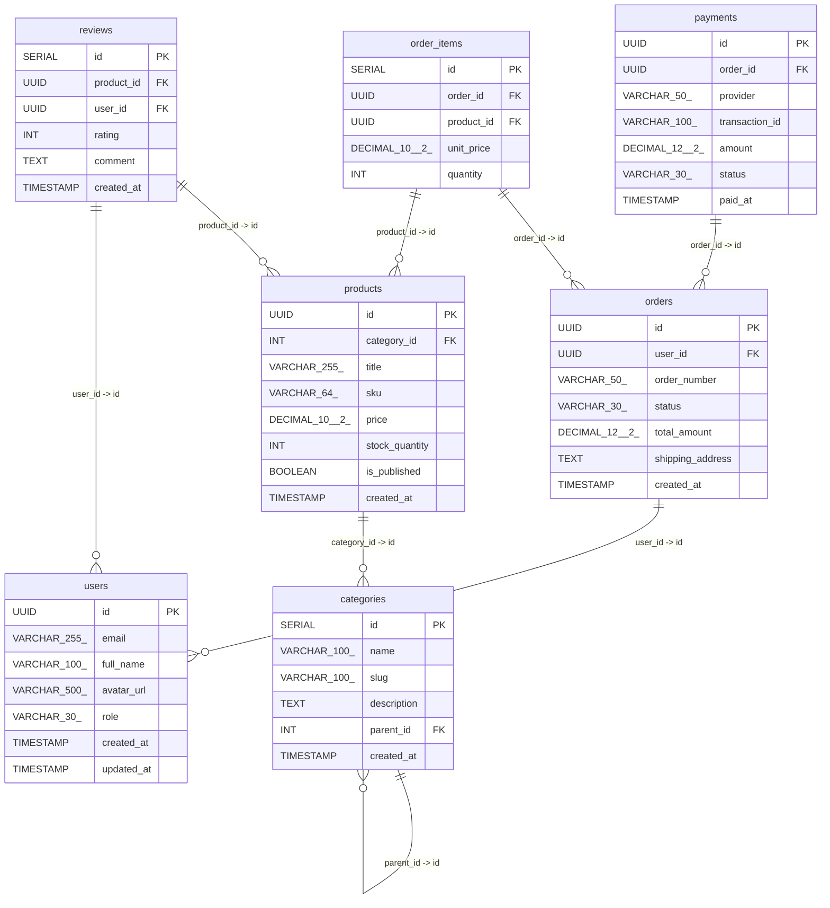

# Database Schema Topology

## 📖 Database Data Dictionary

### Table: `users`

| Column | Type | Constraints | Description |
| :--- | :--- | :--- | :--- |
| `id` | `UUID` | `PRIMARY KEY`, `NOT NULL` | | 
| `email` | `VARCHAR(255)` | `NOT NULL`, `UNIQUE` | | 
| `full_name` | `VARCHAR(100)` | `NOT NULL` | | 
| `avatar_url` | `VARCHAR(500)` | — | | 
| `role` | `VARCHAR(30)` | — | | 
| `created_at` | `TIMESTAMP` | `NOT NULL` | | 
| `updated_at` | `TIMESTAMP` | `NOT NULL` | | 

### Table: `categories`

| Column | Type | Constraints | Description |
| :--- | :--- | :--- | :--- |
| `id` | `SERIAL` | `PRIMARY KEY`, `NOT NULL` | | 
| `name` | `VARCHAR(100)` | `NOT NULL`, `UNIQUE` | | 
| `slug` | `VARCHAR(100)` | `NOT NULL`, `UNIQUE` | | 
| `description` | `TEXT` | — | | 
| `parent_id` | `INT` | `FOREIGN KEY` | | 
| `created_at` | `TIMESTAMP` | `NOT NULL` | | 

### Table: `products`

| Column | Type | Constraints | Description |
| :--- | :--- | :--- | :--- |
| `id` | `UUID` | `PRIMARY KEY`, `NOT NULL` | | 
| `category_id` | `INT` | `FOREIGN KEY`, `NOT NULL` | | 
| `title` | `VARCHAR(255)` | `NOT NULL` | | 
| `sku` | `VARCHAR(64)` | `NOT NULL`, `UNIQUE` | | 
| `price` | `DECIMAL(10, 2)` | `NOT NULL` | | 
| `stock_quantity` | `INT` | `NOT NULL` | | 
| `is_published` | `BOOLEAN` | — | | 
| `created_at` | `TIMESTAMP` | `NOT NULL` | | 

### Table: `orders`

| Column | Type | Constraints | Description |
| :--- | :--- | :--- | :--- |
| `id` | `UUID` | `PRIMARY KEY`, `NOT NULL` | | 
| `user_id` | `UUID` | `FOREIGN KEY`, `NOT NULL` | | 
| `order_number` | `VARCHAR(50)` | `NOT NULL`, `UNIQUE` | | 
| `status` | `VARCHAR(30)` | `NOT NULL` | | 
| `total_amount` | `DECIMAL(12, 2)` | `NOT NULL` | | 
| `shipping_address` | `TEXT` | `NOT NULL` | | 
| `created_at` | `TIMESTAMP` | `NOT NULL` | | 

### Table: `order_items`

| Column | Type | Constraints | Description |
| :--- | :--- | :--- | :--- |
| `id` | `SERIAL` | `PRIMARY KEY`, `NOT NULL` | | 
| `order_id` | `UUID` | `FOREIGN KEY`, `NOT NULL` | | 
| `product_id` | `UUID` | `FOREIGN KEY`, `NOT NULL` | | 
| `unit_price` | `DECIMAL(10, 2)` | `NOT NULL` | | 
| `quantity` | `INT` | `NOT NULL` | | 

### Table: `reviews`

| Column | Type | Constraints | Description |
| :--- | :--- | :--- | :--- |
| `id` | `SERIAL` | `PRIMARY KEY`, `NOT NULL` | | 
| `product_id` | `UUID` | `FOREIGN KEY`, `NOT NULL` | | 
| `user_id` | `UUID` | `FOREIGN KEY`, `NOT NULL` | | 
| `rating` | `INT` | `NOT NULL` | | 
| `comment` | `TEXT` | — | | 
| `created_at` | `TIMESTAMP` | `NOT NULL` | | 

### Table: `payments`

| Column | Type | Constraints | Description |
| :--- | :--- | :--- | :--- |
| `id` | `UUID` | `PRIMARY KEY`, `NOT NULL` | | 
| `order_id` | `UUID` | `FOREIGN KEY`, `NOT NULL`, `UNIQUE` | | 
| `provider` | `VARCHAR(50)` | `NOT NULL` | | 
| `transaction_id` | `VARCHAR(100)` | `NOT NULL` | | 
| `amount` | `DECIMAL(12, 2)` | `NOT NULL` | | 
| `status` | `VARCHAR(30)` | `NOT NULL` | | 
| `paid_at` | `TIMESTAMP` | — | | 

