# Database Schema Topology

```mermaid
erDiagram
    Account ||--o{ Post : "posts -> id"
    Post ||--o{ Account : "author -> id"
    Post ||--o{ Tag : "tags -> id"
    Post ||--o{ User : "author -> id"
    Post ||--o{ Comment : "comments -> id"
    Post ||--o{ User : "authorId -> id"
    Tag ||--o{ Post : "posts -> id"
    User ||--o{ Post : "posts -> id"
    User ||--o{ Comment : "comments -> id"
    Article ||--o{ User : "author -> _id"
    Article ||--o{ Category : "category -> _id"
    Comment ||--o{ Article : "article -> _id"
    Comment ||--o{ User : "author -> _id"
    Comment ||--o{ User : "author -> id"
    Comment ||--o{ Post : "post -> id"
    Comment ||--o{ Task : "taskId -> id"
    categories ||--o{ categories : "parent_id -> id"
    products ||--o{ categories : "category_id -> id"
    products ||--o{ categories : "category_id -> id"
    orders ||--o{ users : "user_id -> id"
    orders ||--o{ users : "user_id -> id"
    order_items ||--o{ orders : "order_id -> id"
    order_items ||--o{ products : "product_id -> id"
    order_items ||--o{ orders : "order_id -> id"
    order_items ||--o{ products : "product_id -> id"
    reviews ||--o{ products : "product_id -> id"
    reviews ||--o{ users : "user_id -> id"
    reviews ||--o{ users : "user_id -> id"
    reviews ||--o{ products : "product_id -> id"
    payments ||--o{ orders : "order_id -> id"
    Course ||--o{ Customer : "instructorId -> _id"
    Enrollment ||--o{ Customer : "studentId -> _id"
    Enrollment ||--o{ Course : "courseId -> _id"
    Profile ||--o{ User : "userId -> id"
    PostTag ||--o{ Post : "postId -> id"
    PostTag ||--o{ Tag : "tagId -> id"
    Organization ||--o{ Team : "teams -> id"
    Member ||--o{ Organization : "organizationId -> id"
    Member ||--o{ Team : "team -> id"
    Project ||--o{ Organization : "organizationId -> id"
    Project ||--o{ Employee : "leadEmployeeId -> id"
    Task ||--o{ Project : "projectId -> id"
    Employee ||--o{ Department : "departmentId -> id"
    Employee ||--o{ Department : "departmentId -> id"
    Employee ||--o{ Department : "departmentId -> id"
    Team ||--o{ Organization : "organization -> id"

    Account {
        ID_ id PK
        String_ email
        String_ username
        Boolean_ isActive
    }
    Post {
        ID_ id PK
        String_ title
        String_ body
        String publishedAt
        ID_ id PK
        String_ title
        String body
        Boolean_ published
        String id PK
        String title
        String_ content
        Boolean published
        String authorId FK
        DateTime createdAt
    }
    Tag {
        ID_ id PK
        String_ name
        String id PK
        String name
    }
    User {
        ObjectId _id PK
        String username
        String email
        String passwordHash
        String bio
        Boolean isActive
        Date createdAt
        ID_ id PK
        String_ name
        String_ email
        String_ createdAt
        String id PK
        String email
        String_ name
        String role
        DateTime createdAt
    }
    Category {
        ObjectId _id PK
        String name
        String slug
        String description
    }
    Article {
        ObjectId _id PK
        String title
        String slug
        String content
        ObjectId author FK
        ObjectId category FK
        _String_ tags
        Number viewCount
        Boolean isPublished
        Date publishedAt
    }
    Comment {
        ObjectId _id PK
        ObjectId article FK
        ObjectId author FK
        String body
        Date createdAt
        ID_ id PK
        String_ message
        String_ createdAt
        String id PK
        String taskId FK
        String authorId
        String content
        DateTime createdAt
    }
    users {
        UUID id PK
        VARCHAR_255_ email
        VARCHAR_100_ full_name
        VARCHAR_500_ avatar_url
        VARCHAR_30_ role
        TIMESTAMP created_at
        TIMESTAMP updated_at
        SERIAL id PK
        VARCHAR_100_ name
        VARCHAR_255_ email
        VARCHAR_255_ password_hash
        VARCHAR_500_ avatar_url
        VARCHAR_20_ role
        TIMESTAMP created_at
    }
    categories {
        SERIAL id PK
        VARCHAR_100_ name
        VARCHAR_100_ slug
        TEXT description
        INT parent_id FK
        TIMESTAMP created_at
        SERIAL id PK
        VARCHAR_100_ name
        VARCHAR_120_ slug
        TEXT description
    }
    products {
        UUID id PK
        INT category_id FK
        VARCHAR_255_ title
        VARCHAR_64_ sku
        DECIMAL_10__2_ price
        INT stock_quantity
        BOOLEAN is_published
        TIMESTAMP created_at
        SERIAL id PK
        INT category_id FK
        VARCHAR_200_ name
        VARCHAR_220_ slug
        DECIMAL_10__2_ price
        INT stock
        BOOLEAN is_active
        TIMESTAMP created_at
    }
    orders {
        UUID id PK
        UUID user_id FK
        VARCHAR_50_ order_number
        VARCHAR_30_ status
        DECIMAL_12__2_ total_amount
        TEXT shipping_address
        TIMESTAMP created_at
        SERIAL id PK
        INT user_id FK
        VARCHAR_50_ order_number
        DECIMAL_10__2_ total_amount
        VARCHAR_50_ status
        VARCHAR_50_ payment_status
        TEXT shipping_address
        TIMESTAMP created_at
    }
    order_items {
        SERIAL id PK
        UUID order_id FK
        UUID product_id FK
        DECIMAL_10__2_ unit_price
        INT quantity
        SERIAL id PK
        INT order_id FK
        INT product_id FK
        INT quantity
        DECIMAL_10__2_ unit_price
    }
    reviews {
        SERIAL id PK
        UUID product_id FK
        UUID user_id FK
        INT rating
        TEXT comment
        TIMESTAMP created_at
        SERIAL id PK
        INT user_id FK
        INT product_id FK
        INT rating
        TEXT comment
        TIMESTAMP created_at
    }
    payments {
        UUID id PK
        UUID order_id FK
        VARCHAR_50_ provider
        VARCHAR_100_ transaction_id
        DECIMAL_12__2_ amount
        VARCHAR_30_ status
        TIMESTAMP paid_at
    }
    Customer {
        ObjectId _id PK
        String username
        String email
        String phone
        Boolean isActive
        Date createdAt
    }
    Course {
        ObjectId _id PK
        String title
        String slug
        Number price
        ObjectId instructorId FK
        String description
        Boolean isPublished
    }
    Enrollment {
        ObjectId _id PK
        ObjectId studentId FK
        ObjectId courseId FK
        Date enrolledAt
        Number progress
    }
    Profile {
        String id PK
        String_ bio
        String userId FK
    }
    PostTag {
        String postId PK
        String tagId PK
    }
    Organization {
        String id PK
        String name
        String slug
        String plan
        DateTime createdAt
        DateTime updatedAt
        string id PK
        varchar name
        varchar domain
    }
    Member {
        String id PK
        String organizationId FK
        String userId
        String role
        DateTime joinedAt
        string id PK
        varchar fullName
        varchar email
        UUID_Int teamId FK
    }
    Project {
        String id PK
        String organizationId FK
        String title
        String_ description
        Boolean isArchived
        DateTime createdAt
        INTEGER id PK
        STRING title
        INTEGER leadEmployeeId FK
    }
    Task {
        String id PK
        String projectId FK
        String title
        String status
        String priority
        DateTime_ dueDate
    }
    Department {
        INTEGER id PK
        STRING name
        FLOAT budget
    }
    Employee {
        INTEGER id PK
        STRING firstName
        STRING lastName
        STRING email
        INTEGER departmentId FK
        INTEGER salary
    }
    Team {
        string id PK
        varchar title
        UUID_Int organizationId FK
    }
```

## 📖 Database Data Dictionary

### Table: `Account`

| Column | Type | Constraints | Description |
| :--- | :--- | :--- | :--- |
| `id` | `ID!` | `PRIMARY KEY`, `NOT NULL`, `UNIQUE` | | 
| `email` | `String!` | `NOT NULL` | | 
| `username` | `String!` | `NOT NULL` | | 
| `isActive` | `Boolean!` | `NOT NULL` | | 

### Table: `Post`

| Column | Type | Constraints | Description |
| :--- | :--- | :--- | :--- |
| `id` | `ID!` | `PRIMARY KEY`, `NOT NULL`, `UNIQUE` | | 
| `title` | `String!` | `NOT NULL` | | 
| `body` | `String!` | `NOT NULL` | | 
| `publishedAt` | `String` | — | | 
| `id` | `ID!` | `PRIMARY KEY`, `NOT NULL`, `UNIQUE` | | 
| `title` | `String!` | `NOT NULL` | | 
| `body` | `String` | — | | 
| `published` | `Boolean!` | `NOT NULL` | | 
| `id` | `String` | `PRIMARY KEY`, `NOT NULL` | | 
| `title` | `String` | `NOT NULL` | | 
| `content` | `String?` | — | | 
| `published` | `Boolean` | `NOT NULL` | | 
| `authorId` | `String` | `FOREIGN KEY`, `NOT NULL` | | 
| `createdAt` | `DateTime` | `NOT NULL` | | 

### Table: `Tag`

| Column | Type | Constraints | Description |
| :--- | :--- | :--- | :--- |
| `id` | `ID!` | `PRIMARY KEY`, `NOT NULL`, `UNIQUE` | | 
| `name` | `String!` | `NOT NULL` | | 
| `id` | `String` | `PRIMARY KEY`, `NOT NULL` | | 
| `name` | `String` | `NOT NULL`, `UNIQUE` | | 

### Table: `User`

| Column | Type | Constraints | Description |
| :--- | :--- | :--- | :--- |
| `_id` | `ObjectId` | `PRIMARY KEY`, `NOT NULL`, `UNIQUE` | | 
| `username` | `String` | `NOT NULL`, `UNIQUE` | | 
| `email` | `String` | `NOT NULL`, `UNIQUE` | | 
| `passwordHash` | `String` | `NOT NULL` | | 
| `bio` | `String` | — | | 
| `isActive` | `Boolean` | — | | 
| `createdAt` | `Date` | — | | 
| `id` | `ID!` | `PRIMARY KEY`, `NOT NULL`, `UNIQUE` | | 
| `name` | `String!` | `NOT NULL` | | 
| `email` | `String!` | `NOT NULL` | | 
| `createdAt` | `String!` | `NOT NULL` | | 
| `id` | `String` | `PRIMARY KEY`, `NOT NULL` | | 
| `email` | `String` | `NOT NULL`, `UNIQUE` | | 
| `name` | `String?` | — | | 
| `role` | `String` | `NOT NULL` | | 
| `createdAt` | `DateTime` | `NOT NULL` | | 

### Table: `Category`

| Column | Type | Constraints | Description |
| :--- | :--- | :--- | :--- |
| `_id` | `ObjectId` | `PRIMARY KEY`, `NOT NULL`, `UNIQUE` | | 
| `name` | `String` | `NOT NULL`, `UNIQUE` | | 
| `slug` | `String` | `NOT NULL` | | 
| `description` | `String` | — | | 

### Table: `Article`

| Column | Type | Constraints | Description |
| :--- | :--- | :--- | :--- |
| `_id` | `ObjectId` | `PRIMARY KEY`, `NOT NULL`, `UNIQUE` | | 
| `title` | `String` | `NOT NULL` | | 
| `slug` | `String` | `NOT NULL`, `UNIQUE` | | 
| `content` | `String` | `NOT NULL` | | 
| `author` | `ObjectId` | `FOREIGN KEY`, `NOT NULL` | | 
| `category` | `ObjectId` | `FOREIGN KEY` | | 
| `tags` | `[String]` | — | | 
| `viewCount` | `Number` | — | | 
| `isPublished` | `Boolean` | — | | 
| `publishedAt` | `Date` | — | | 

### Table: `Comment`

| Column | Type | Constraints | Description |
| :--- | :--- | :--- | :--- |
| `_id` | `ObjectId` | `PRIMARY KEY`, `NOT NULL`, `UNIQUE` | | 
| `article` | `ObjectId` | `FOREIGN KEY`, `NOT NULL` | | 
| `author` | `ObjectId` | `FOREIGN KEY`, `NOT NULL` | | 
| `body` | `String` | `NOT NULL` | | 
| `createdAt` | `Date` | — | | 
| `id` | `ID!` | `PRIMARY KEY`, `NOT NULL`, `UNIQUE` | | 
| `message` | `String!` | `NOT NULL` | | 
| `createdAt` | `String!` | `NOT NULL` | | 
| `id` | `String` | `PRIMARY KEY`, `NOT NULL` | | 
| `taskId` | `String` | `FOREIGN KEY`, `NOT NULL` | | 
| `authorId` | `String` | `NOT NULL` | | 
| `content` | `String` | `NOT NULL` | | 
| `createdAt` | `DateTime` | `NOT NULL` | | 

### Table: `users`

| Column | Type | Constraints | Description |
| :--- | :--- | :--- | :--- |
| `id` | `UUID` | `PRIMARY KEY`, `NOT NULL` | | 
| `email` | `VARCHAR(255)` | `NOT NULL`, `UNIQUE` | | 
| `full_name` | `VARCHAR(100)` | `NOT NULL` | | 
| `avatar_url` | `VARCHAR(500)` | — | | 
| `role` | `VARCHAR(30)` | — | | 
| `created_at` | `TIMESTAMP` | `NOT NULL` | | 
| `updated_at` | `TIMESTAMP` | `NOT NULL` | | 
| `id` | `SERIAL` | `PRIMARY KEY`, `NOT NULL` | | 
| `name` | `VARCHAR(100)` | `NOT NULL` | | 
| `email` | `VARCHAR(255)` | `NOT NULL`, `UNIQUE` | | 
| `password_hash` | `VARCHAR(255)` | `NOT NULL` | | 
| `avatar_url` | `VARCHAR(500)` | — | | 
| `role` | `VARCHAR(20)` | — | | 
| `created_at` | `TIMESTAMP` | — | | 

### Table: `categories`

| Column | Type | Constraints | Description |
| :--- | :--- | :--- | :--- |
| `id` | `SERIAL` | `PRIMARY KEY`, `NOT NULL` | | 
| `name` | `VARCHAR(100)` | `NOT NULL`, `UNIQUE` | | 
| `slug` | `VARCHAR(100)` | `NOT NULL`, `UNIQUE` | | 
| `description` | `TEXT` | — | | 
| `parent_id` | `INT` | `FOREIGN KEY` | | 
| `created_at` | `TIMESTAMP` | `NOT NULL` | | 
| `id` | `SERIAL` | `PRIMARY KEY`, `NOT NULL` | | 
| `name` | `VARCHAR(100)` | `NOT NULL` | | 
| `slug` | `VARCHAR(120)` | `NOT NULL`, `UNIQUE` | | 
| `description` | `TEXT` | — | | 

### Table: `products`

| Column | Type | Constraints | Description |
| :--- | :--- | :--- | :--- |
| `id` | `UUID` | `PRIMARY KEY`, `NOT NULL` | | 
| `category_id` | `INT` | `FOREIGN KEY`, `NOT NULL` | | 
| `title` | `VARCHAR(255)` | `NOT NULL` | | 
| `sku` | `VARCHAR(64)` | `NOT NULL`, `UNIQUE` | | 
| `price` | `DECIMAL(10, 2)` | `NOT NULL` | | 
| `stock_quantity` | `INT` | `NOT NULL` | | 
| `is_published` | `BOOLEAN` | — | | 
| `created_at` | `TIMESTAMP` | `NOT NULL` | | 
| `id` | `SERIAL` | `PRIMARY KEY`, `NOT NULL` | | 
| `category_id` | `INT` | `FOREIGN KEY`, `NOT NULL` | | 
| `name` | `VARCHAR(200)` | `NOT NULL` | | 
| `slug` | `VARCHAR(220)` | `NOT NULL`, `UNIQUE` | | 
| `price` | `DECIMAL(10, 2)` | `NOT NULL` | | 
| `stock` | `INT` | — | | 
| `is_active` | `BOOLEAN` | — | | 
| `created_at` | `TIMESTAMP` | — | | 

### Table: `orders`

| Column | Type | Constraints | Description |
| :--- | :--- | :--- | :--- |
| `id` | `UUID` | `PRIMARY KEY`, `NOT NULL` | | 
| `user_id` | `UUID` | `FOREIGN KEY`, `NOT NULL` | | 
| `order_number` | `VARCHAR(50)` | `NOT NULL`, `UNIQUE` | | 
| `status` | `VARCHAR(30)` | `NOT NULL` | | 
| `total_amount` | `DECIMAL(12, 2)` | `NOT NULL` | | 
| `shipping_address` | `TEXT` | `NOT NULL` | | 
| `created_at` | `TIMESTAMP` | `NOT NULL` | | 
| `id` | `SERIAL` | `PRIMARY KEY`, `NOT NULL` | | 
| `user_id` | `INT` | `FOREIGN KEY`, `NOT NULL` | | 
| `order_number` | `VARCHAR(50)` | `NOT NULL`, `UNIQUE` | | 
| `total_amount` | `DECIMAL(10, 2)` | `NOT NULL` | | 
| `status` | `VARCHAR(50)` | — | | 
| `payment_status` | `VARCHAR(50)` | — | | 
| `shipping_address` | `TEXT` | `NOT NULL` | | 
| `created_at` | `TIMESTAMP` | — | | 

### Table: `order_items`

| Column | Type | Constraints | Description |
| :--- | :--- | :--- | :--- |
| `id` | `SERIAL` | `PRIMARY KEY`, `NOT NULL` | | 
| `order_id` | `UUID` | `FOREIGN KEY`, `NOT NULL` | | 
| `product_id` | `UUID` | `FOREIGN KEY`, `NOT NULL` | | 
| `unit_price` | `DECIMAL(10, 2)` | `NOT NULL` | | 
| `quantity` | `INT` | `NOT NULL` | | 
| `id` | `SERIAL` | `PRIMARY KEY`, `NOT NULL` | | 
| `order_id` | `INT` | `FOREIGN KEY`, `NOT NULL` | | 
| `product_id` | `INT` | `FOREIGN KEY`, `NOT NULL` | | 
| `quantity` | `INT` | `NOT NULL` | | 
| `unit_price` | `DECIMAL(10, 2)` | `NOT NULL` | | 

### Table: `reviews`

| Column | Type | Constraints | Description |
| :--- | :--- | :--- | :--- |
| `id` | `SERIAL` | `PRIMARY KEY`, `NOT NULL` | | 
| `product_id` | `UUID` | `FOREIGN KEY`, `NOT NULL` | | 
| `user_id` | `UUID` | `FOREIGN KEY`, `NOT NULL` | | 
| `rating` | `INT` | `NOT NULL` | | 
| `comment` | `TEXT` | — | | 
| `created_at` | `TIMESTAMP` | `NOT NULL` | | 
| `id` | `SERIAL` | `PRIMARY KEY`, `NOT NULL` | | 
| `user_id` | `INT` | `FOREIGN KEY`, `NOT NULL` | | 
| `product_id` | `INT` | `FOREIGN KEY`, `NOT NULL` | | 
| `rating` | `INT` | `NOT NULL` | | 
| `comment` | `TEXT` | — | | 
| `created_at` | `TIMESTAMP` | — | | 

### Table: `payments`

| Column | Type | Constraints | Description |
| :--- | :--- | :--- | :--- |
| `id` | `UUID` | `PRIMARY KEY`, `NOT NULL` | | 
| `order_id` | `UUID` | `FOREIGN KEY`, `NOT NULL`, `UNIQUE` | | 
| `provider` | `VARCHAR(50)` | `NOT NULL` | | 
| `transaction_id` | `VARCHAR(100)` | `NOT NULL` | | 
| `amount` | `DECIMAL(12, 2)` | `NOT NULL` | | 
| `status` | `VARCHAR(30)` | `NOT NULL` | | 
| `paid_at` | `TIMESTAMP` | — | | 

### Table: `Customer`

| Column | Type | Constraints | Description |
| :--- | :--- | :--- | :--- |
| `_id` | `ObjectId` | `PRIMARY KEY`, `NOT NULL`, `UNIQUE` | | 
| `username` | `String` | `NOT NULL`, `UNIQUE` | | 
| `email` | `String` | `NOT NULL`, `UNIQUE` | | 
| `phone` | `String` | — | | 
| `isActive` | `Boolean` | — | | 
| `createdAt` | `Date` | — | | 

### Table: `Course`

| Column | Type | Constraints | Description |
| :--- | :--- | :--- | :--- |
| `_id` | `ObjectId` | `PRIMARY KEY`, `NOT NULL`, `UNIQUE` | | 
| `title` | `String` | `NOT NULL` | | 
| `slug` | `String` | `NOT NULL`, `UNIQUE` | | 
| `price` | `Number` | `NOT NULL` | | 
| `instructorId` | `ObjectId` | `FOREIGN KEY`, `NOT NULL` | | 
| `description` | `String` | — | | 
| `isPublished` | `Boolean` | — | | 

### Table: `Enrollment`

| Column | Type | Constraints | Description |
| :--- | :--- | :--- | :--- |
| `_id` | `ObjectId` | `PRIMARY KEY`, `NOT NULL`, `UNIQUE` | | 
| `studentId` | `ObjectId` | `FOREIGN KEY`, `NOT NULL` | | 
| `courseId` | `ObjectId` | `FOREIGN KEY`, `NOT NULL` | | 
| `enrolledAt` | `Date` | — | | 
| `progress` | `Number` | — | | 

### Table: `Profile`

| Column | Type | Constraints | Description |
| :--- | :--- | :--- | :--- |
| `id` | `String` | `PRIMARY KEY`, `NOT NULL` | | 
| `bio` | `String?` | — | | 
| `userId` | `String` | `FOREIGN KEY`, `NOT NULL`, `UNIQUE` | | 

### Table: `PostTag`

| Column | Type | Constraints | Description |
| :--- | :--- | :--- | :--- |
| `postId` | `String` | `PRIMARY KEY`, `FOREIGN KEY`, `NOT NULL` | | 
| `tagId` | `String` | `PRIMARY KEY`, `FOREIGN KEY`, `NOT NULL` | | 

### Table: `Organization`

| Column | Type | Constraints | Description |
| :--- | :--- | :--- | :--- |
| `id` | `String` | `PRIMARY KEY`, `NOT NULL` | | 
| `name` | `String` | `NOT NULL` | | 
| `slug` | `String` | `NOT NULL`, `UNIQUE` | | 
| `plan` | `String` | `NOT NULL` | | 
| `createdAt` | `DateTime` | `NOT NULL` | | 
| `updatedAt` | `DateTime` | `NOT NULL` | | 
| `id` | `string` | `PRIMARY KEY`, `NOT NULL` | | 
| `name` | `varchar` | `NOT NULL` | | 
| `domain` | `varchar` | `NOT NULL`, `UNIQUE` | | 

### Table: `Member`

| Column | Type | Constraints | Description |
| :--- | :--- | :--- | :--- |
| `id` | `String` | `PRIMARY KEY`, `NOT NULL` | | 
| `organizationId` | `String` | `FOREIGN KEY`, `NOT NULL` | | 
| `userId` | `String` | `NOT NULL` | | 
| `role` | `String` | `NOT NULL` | | 
| `joinedAt` | `DateTime` | `NOT NULL` | | 
| `id` | `string` | `PRIMARY KEY`, `NOT NULL` | | 
| `fullName` | `varchar` | `NOT NULL` | | 
| `email` | `varchar` | `NOT NULL`, `UNIQUE` | | 
| `teamId` | `UUID/Int` | `FOREIGN KEY`, `NOT NULL` | | 

### Table: `Project`

| Column | Type | Constraints | Description |
| :--- | :--- | :--- | :--- |
| `id` | `String` | `PRIMARY KEY`, `NOT NULL` | | 
| `organizationId` | `String` | `FOREIGN KEY`, `NOT NULL` | | 
| `title` | `String` | `NOT NULL` | | 
| `description` | `String?` | — | | 
| `isArchived` | `Boolean` | `NOT NULL` | | 
| `createdAt` | `DateTime` | `NOT NULL` | | 
| `id` | `INTEGER` | `PRIMARY KEY`, `NOT NULL` | | 
| `title` | `STRING` | `NOT NULL` | | 
| `leadEmployeeId` | `INTEGER` | `FOREIGN KEY` | | 

### Table: `Task`

| Column | Type | Constraints | Description |
| :--- | :--- | :--- | :--- |
| `id` | `String` | `PRIMARY KEY`, `NOT NULL` | | 
| `projectId` | `String` | `FOREIGN KEY`, `NOT NULL` | | 
| `title` | `String` | `NOT NULL` | | 
| `status` | `String` | `NOT NULL` | | 
| `priority` | `String` | `NOT NULL` | | 
| `dueDate` | `DateTime?` | — | | 

### Table: `Department`

| Column | Type | Constraints | Description |
| :--- | :--- | :--- | :--- |
| `id` | `INTEGER` | `PRIMARY KEY`, `NOT NULL` | | 
| `name` | `STRING` | `NOT NULL`, `UNIQUE` | | 
| `budget` | `FLOAT` | — | | 

### Table: `Employee`

| Column | Type | Constraints | Description |
| :--- | :--- | :--- | :--- |
| `id` | `INTEGER` | `PRIMARY KEY`, `NOT NULL` | | 
| `firstName` | `STRING` | `NOT NULL` | | 
| `lastName` | `STRING` | `NOT NULL` | | 
| `email` | `STRING` | `NOT NULL`, `UNIQUE` | | 
| `departmentId` | `INTEGER` | `FOREIGN KEY` | | 
| `salary` | `INTEGER` | — | | 

### Table: `Team`

| Column | Type | Constraints | Description |
| :--- | :--- | :--- | :--- |
| `id` | `string` | `PRIMARY KEY`, `NOT NULL` | | 
| `title` | `varchar` | `NOT NULL` | | 
| `organizationId` | `UUID/Int` | `FOREIGN KEY`, `NOT NULL` | | 

